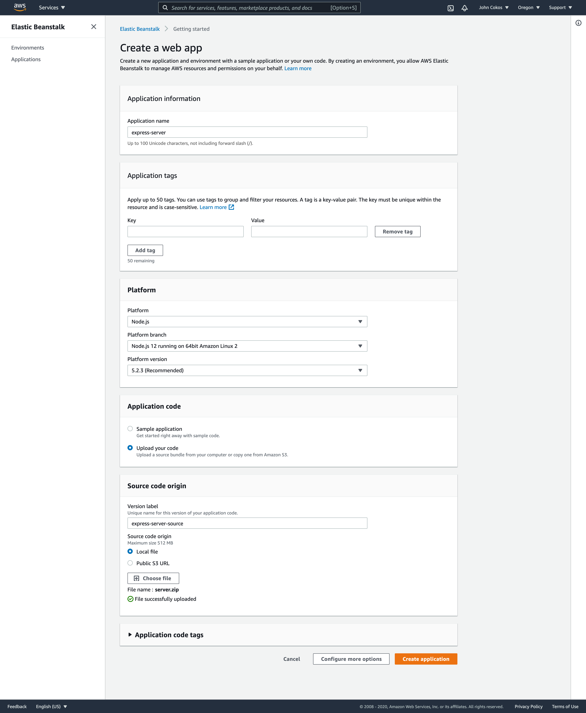

# Class 16: Intro to AWS

## Announcements

- Last week was better
  - Feeling like lab words are crap.
  - We are making improvements.
- Midterms are next week!  No mini project week.
  - No CCW / DSA -> project kick off.
- 1 on 1 synchs: https://jacobknaack.youcanbook.me
  - Fill out the synch assignment.
  - I'm going to move those to be due Friday evening.

## Presentations: Event Driven Applications

4 teams:

Team 3 - Andrew / Dario / Joey / Jacob.

- Help Hub
  - Help ticket system,  service workers and client users that can connect.
  - Build something into the client to help the server.

Team 2 - Steve / Emily / Matt / Scott

- The Anxiety Room (Giving and handling anxiety)
  - 2 clients - receiver and producer
    - random number generation to assign insults to the receiver.
    - things went well in development but ran into some bugs with deployment.
  - Deploying statful apps to Heroku is difficult.

Team 1 - Erik / Michael Hendricks / Spencer / Ryan

- Who can create better words.
  - 2 clients as players.
  - Kinda scrabble like.
  - Goal is to make the longest words.
  - Lots of state baked into the server hub.
  - really great modular approach to a word game.
  - Even have stretch goals.
    - Really cool engineering tasks for creating random words and mixing them up.
    - Really great join using third party apps.

Team 4 - Daniel / Kellen / Kiean / Michael Metcalf

- Messaging app built with socket.io (socki-talki)
  - Messaging application between clients.
  - Uses globally installed local package.
  - Uses 3rd party CLI packages.
  - Live deployed chat application via Heroku!

## Code Challenge / Warm Up (30 mins)

Prompt: Given a Binary Tree containing integers, return the sum of all Integers on the second level of the tree.

- Daniel: second level directly under the root level? Yes!!
- Andrew: each node has a left right and a value? yes!
- Matt: All positive integers! yes!
- Keian: Value is null? Nope, value will always be an Integer!
- Emily: Optimized for efficiency, ideally yes but really no.

```js

// given a BT sum all values on the second level.
// Efficiency 
//   time O(1)
//   space O(1)
function sumLevelTwo(root) {

  // get the values from the left and right of the root
  // let value = 0;
  let leftVal = 0;
  let rightVal = 0;

  if (root.left) {
    leftVal = root.left.value;
  }
  if (root.right) {
    rightVal = root.right.value;
  }

  // add those values
  // return the sum
  return leftVal + rightVal;
}
```

- Adding everything and subtracting the root?
- How would you get values above or below?

## AWS Products (30 mins)

Amazon Web Services

- Developer Operations: Where does our Code Run?  Does it work in that environment.
  - Low Code week.
  - No new Design Patterns.
  - Everyday this week will be a new AWS Product.

Why learn EC2 and Elastic Beanstalk?

- Beacuse doing it(hosting a web service, deploying a website)
  - Back in the day (10 - 15 years).

## EC2 (Virtual Machines) and Elastic Beanstalk (50 mins)

EC2 - Computers running in the cloud.  
Heroku - This uses Elastic Beanstalk, one step above the GUI that takes care of everything we are about to do.

Using the AWS Elastic Beanstalk GUI:

1. Choose NodeJS as your platform.
1. Create and upload a .zip file with your application source code.
1. Do not include node_modules or package-lock.json.

- This will create your application and environment in one step, giving you a full GUI from where you can manage the app.

1. Once it's installed, follow the link given to see the running server output in your browser.
1. Go to the EC2 page, you'll see that it's created an instance for you.


- NOTE:  The above image may have options that are not available or are deprecated, please make sure you are adding the recommended setting from AWS.

Using the `eb` Command Line Interface

1. `eb init` - Initializes your folder as an Elastic Beanstalk application

- Choose your region (us-west-2)
- Choose [Create new Application]
  - Note: If you already have an application, you could also choose that to connect
  - Answer the other questions as appropriate
    - Choose Node.js at the correct version

1. `eb create my-environment-name` - Create an "environment" for your app to reside in
1. `eb deploy` - deploy your new application to your new environment
   - You'll also use this whenever you make code changes
